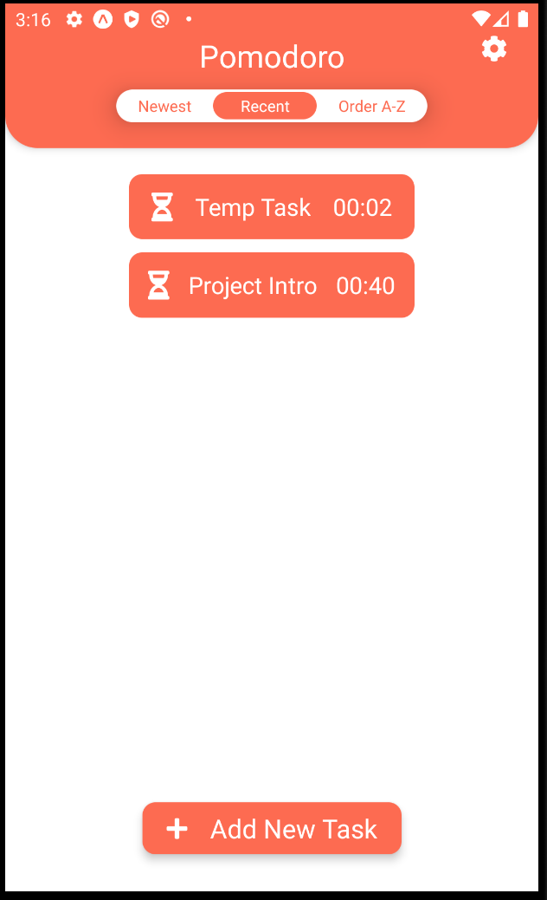
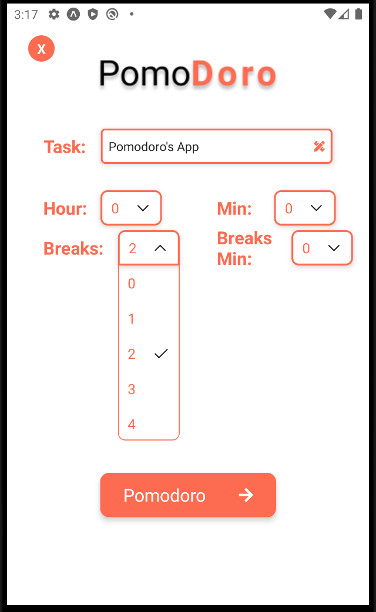
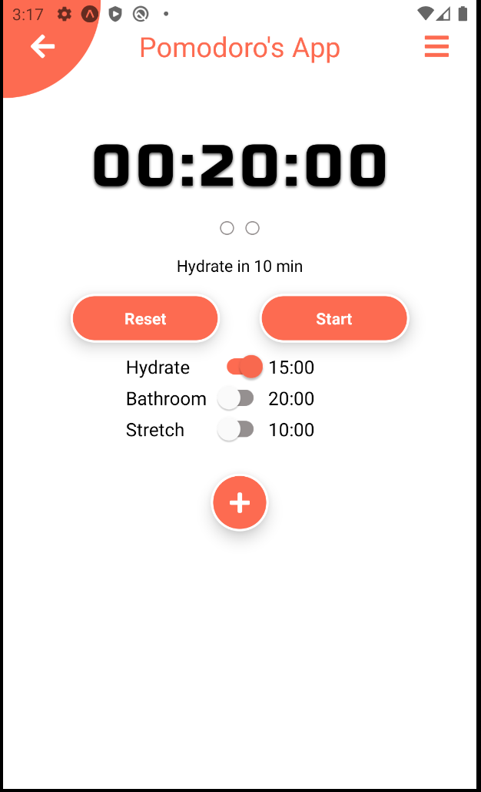

# Pomodoro Mobile Application

The goal of this project is to increase my knowledge of React Native and mobile design/engineer. Pomodoro is a time management technique that utilizes breaks and "sprints" for better workflow. I decided to make a "Pomodoro" application to one day create an user ready mobile app for the market. Design and development is done solely by me.

## Skills

With this project, I attended to learn some tools/skills for professional use:

- React Native
- React navigation
- Timing and States
- Mobile Design

## Experience

With my background in react.js, this project was my first real attempt at an react native mobile application. I learned how states works within react native.

## Future

- Habits isn't implemented
- Wording under timer isn't implemented
- Pomodoro timer is not updating on regular time.
